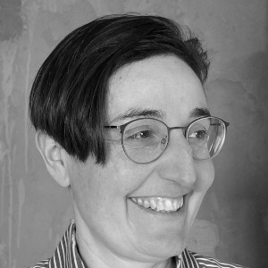

 

   
 

 

   
Denotation CEO, Dr. Aurelie Herbelot, started her research in Natural Language Processing in 2006 at the University of Cambridge (UK). Her aim was to give machines a deep understanding of a subtle language phenomenon called 'genericity', responsible for potentially catastrophic errors in sentence interpretation. Seventeen years later, her goal has remained the same: build the most secure language systems there can be.

   
The AIs we interact with today have many potential points of failure, from the data they are trained on to their particular mode of interpretation of human language. When using them to make decisions, or perform any critical task, we need them to work for us, not against us.

 

